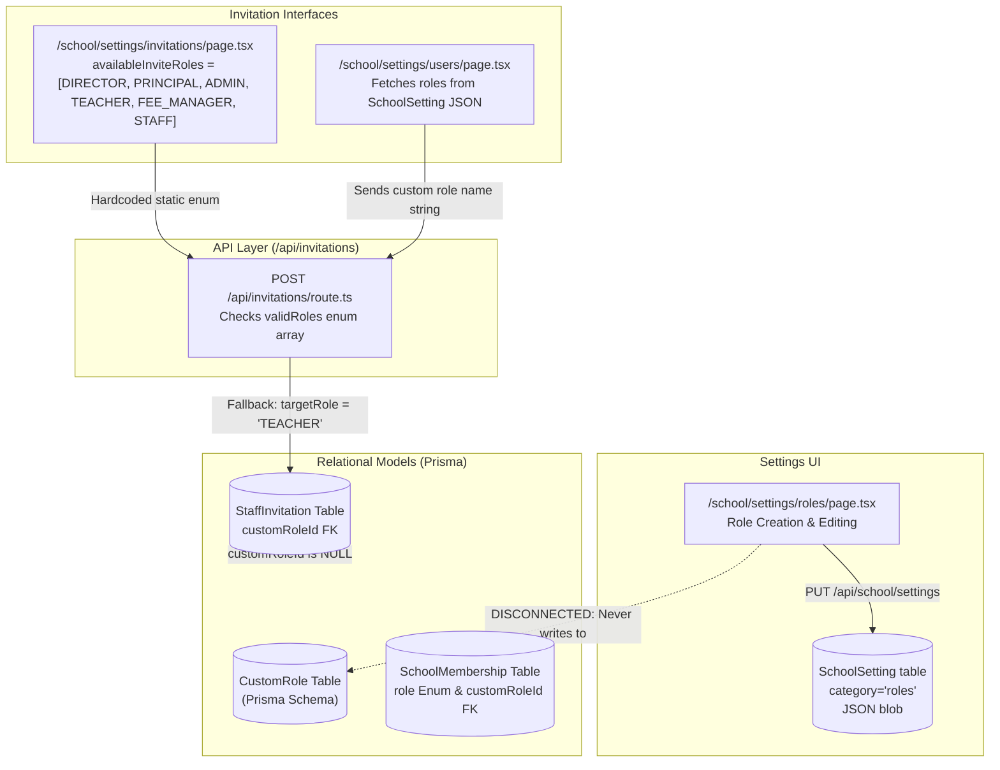

# Rivo — Role-to-Invitation Integration Audit & Fee Management Deep Audit Report

**Audit Date:** October 10, 2026  
**Auditor:** Antigravity AI Engineering & Security Systems  
**Repository Branch / Commit:** `main` @ `9177f3cdc095a6b37bfeeb5f698d2fad28f697aa`  
**Working Tree Status:** Clean (1 untracked maintenance script: `scripts/system-reset.ts`; no production files modified).  
**Phase:** **Audit & Reporting Only** (No fixes applied, zero code mutations, zero production database changes).

---

## 1. Executive Summary

This comprehensive, repository-backed audit evaluated two critical enterprise subsystems of the Rivo School Management System:

1. **Part A: Role Configuration → Invitation System Integration**  
   Tracing the lifecycle from `Settings -> Roles and Permissions` (`/school/settings/roles`), through `Centralized Invitations` (`/school/settings/invitations`) and `User Management` (`/school/settings/users`), to backend authorization, delivery, acceptance, and database persistence.
2. **Part B: Fee Management Module — End-to-End Functional, Security & Architectural Audit**  
   Auditing the financial core from Fee Heads and Fee Plans through installment assignment, obligation schedules, collection payments, cash/UPI/bank settlements, atomic reversals, ad-hoc concessions, legal receipt PDF generation, student/parent portals, tenant isolation, and automated regression testing.

### Key Verdict Summary

| Subsystem | Audit Status | Final Readiness Verdict | Summary Assessment |
|---|---|---|---|
| **Role-to-Invitation Integration** | Audited (Code & DB flow traced) | **NOT READY** | **Severe Architectural Split & Broken Propagation.** Custom roles created in Settings are saved into generic JSON settings (`SchoolSetting`), bypassing Prisma's relational `CustomRole` table. Centralized invitation UI hardcodes static roles. In the User Management invite modal, custom role names are sent to `/api/invitations` where the server falls back to `'TEACHER'`, silently downgrading custom invitees. |
| **Fee Management Module** | Audited & Validated (60/60 Tests Passed) | **READY WITH KNOWN ISSUES** | **Robust Financial Backend Core with Front-End Surface Gaps.** The backend service (`fee-payment-service.ts`, `fee-plan-service.ts`, `fee-pdf-service.ts`) features atomic Prisma `$transaction` operations, Decimal precision, immutable snapshots, oldest-due-first FIFO allocations, and tenant isolation (60/60 automated tests passing). However, parent portal fee visibility is missing, online payment gateway webhooks are not implemented, and student tab balances compute against a mismatched payment status string (`'SUCCESS'` vs `'COLLECTED'`). |

---

## 2. Scope & Audit Methodology

The audit was executed strictly without modifying production application code, deploying mutations, or executing non-sandboxed database modifications. The methodology comprised:

1. **Static Analysis & Code Tracing:** Complete file-by-file inspection of UI components, server routes, services, middleware, and Prisma schemas.
2. **Schema & Referential Integrity Inspection:** Verification of relations, indexes, composite unique keys, cascade rules, and Decimal field types in `apps/web/prisma/schema.prisma`.
3. **Authorization & Security Review:** Scrutiny of `requireAuth`, permission gates, tenant/school boundary validation, role escalation prevention, and payment manipulation surfaces.
4. **Settings-to-Runtime Dependency Tracing:** Verification of whether settings configured in `SchoolSetting` (under `roles` and `fees` categories) actually govern server-side execution.
5. **Non-Destructive Automated Test Assessment:** Execution of the comprehensive integration test suite `apps/web/src/__tests__/fee-management-foundation.test.ts` within isolated test tenant partitions with immediate teardown.

---

## 3. Repository Commit & Working-Tree Status

- **Branch:** `main`
- **Commit SHA:** `9177f3cdc095a6b37bfeeb5f698d2fad28f697aa`
- **Working Directory:** `d:\Rivo`
- **Working Tree:**
  ```text
  ?? scripts/system-reset.ts
  ```
- **Integrity Statement:** No modified application files exist in the working tree. All audits and test runs left no persistent test tenant residues.

---

## 4. Part A — Role Configuration-to-Invitation Architecture & Data Flow

### 4.1 Complete Role Lifecycle Trace



### 4.2 Lifecycle Findings

1. **Role Creation & Storage Split (`P0`):**
   - **File:** [roles/page.tsx](file:///d:/Rivo/apps/web/src/app/(school)/school/settings/roles/page.tsx#L190-L245)
   - When an administrator creates a new custom role (e.g. "Hostel Warden", "Exam Controller"), it is persisted via `PUT /api/school/settings` with `category: 'roles'`, storing an unindexed JSON array inside the `SchoolSetting` table.
   - It **does not create a record** in the Prisma `CustomRole` table (`apps/web/prisma/schema.prisma:721-740`).
2. **Centralized Invitation Hardcoding (`P1`):**
   - **File:** [invitations/page.tsx](file:///d:/Rivo/apps/web/src/app/(school)/school/settings/invitations/page.tsx#L107-L115)
   - The centralized invitations screen declares a static array:
     ```typescript
     const availableInviteRoles: { role: string; label: string; desc: string }[] = [
       { role: 'DIRECTOR', label: 'Director', desc: 'Complete executive governance...' },
       { role: 'PRINCIPAL', label: 'Principal', desc: 'Academic and administrative leader...' },
       { role: 'ADMIN', label: 'Administrator', desc: 'Operational day-to-day admin...' },
       { role: 'TEACHER', label: 'Teacher / Faculty', desc: 'Instructional staff...' },
       { role: 'FEE_MANAGER', label: 'Fee / Finance Officer', desc: 'Financial desk...' },
       { role: 'STAFF', label: 'Support Staff', desc: 'General administrative support...' },
     ];
     ```
   - Custom roles created in Settings **never appear** in this interface.
3. **Silent Custom Role Degradation (`P0`):**
   - **File:** [users/page.tsx](file:///d:/Rivo/apps/web/src/app/(school)/school/settings/users/page.tsx#L550-L580) & [/api/invitations/route.ts](file:///d:/Rivo/apps/web/src/app/api/invitations/route.ts#L65-L85)
   - The User Management invite modal reads custom roles from the JSON setting and sends `role: inviteRole.toUpperCase().replace(/\s+/g, '_')` to `POST /api/invitations`.
   - In `/api/invitations/route.ts`, lines 71-73:
     ```typescript
     const validRoles = ['DIRECTOR', 'PRINCIPAL', 'ADMIN', 'TEACHER', 'FEE_MANAGER', 'STAFF', 'SCHOOL_ADMIN'];
     const targetRole = validRoles.includes(role) ? role : 'TEACHER';
     ```
   - If an admin creates a custom role "Senior Accountant" and invites a user, `validRoles.includes('SENIOR_ACCOUNTANT')` evaluates to `false`. The server **silently degrades the invitation to `TEACHER`** without throwing an error or warning the inviter. The `customRoleId` column on `StaffInvitation` is left `NULL`.
4. **Acceptance & Membership Linkage (`P1`):**
   - **File:** [/api/invitations/accept/route.ts](file:///d:/Rivo/apps/web/src/app/api/invitations/accept/route.ts#L80-L105)
   - Upon acceptance, `SchoolMembership` is created using `invitation.role` as an enum and `invitation.customRoleId`. Because `customRoleId` was never set, the user is admitted as a standard `Role.TEACHER` with default teacher permissions.

---

## 5. Role-to-Invitation Mapping Table

| Role Source | Invitation Interface | Data Source / Fetch Method | Role Appears Dynamically? | Backend Validated Against Custom Roles? | Result | Evidence File & Lines |
|---|---|---|---|---|---|---|
| Settings Roles (`SchoolSetting` JSON) | `/school/settings/invitations` | Hardcoded `availableInviteRoles` array | **NO** (Static 6 roles only) | **NO** (Only built-in enum allowed) | **FAIL** | `invitations/page.tsx:107-115` |
| Settings Roles (`SchoolSetting` JSON) | `/school/settings/users` (Invite Modal) | `GET /api/school/settings?category=roles` | **YES** (Listed from JSON) | **NO** (Silently downgraded to `TEACHER`) | **FAIL** | `users/page.tsx:556`, `/api/invitations/route.ts:72` |
| Prisma `CustomRole` Table | Any Invitation UI | None | **NO** (Table is never queried by UI) | Supported in schema & API parameter `customRoleId`, but no UI passes it | **FAIL** | `schema.prisma:721`, `/api/invitations/route.ts:46` |
| Built-in Enum Roles | `/school/settings/invitations` | Static hardcoded constant | **YES** (Pre-populated) | **YES** (`validRoles.includes`) | **PARTIAL** | `invitations/page.tsx:107` |
| Built-in Enum Roles | `/school/settings/users` | Hardcoded fallback / JSON settings | **YES** | **YES** | **PASS** | `users/page.tsx:550` |

---

## 6. Part B — Fee Management Module Inventory & Architecture

### 6.1 Complete File & Component Inventory

| Category | Component / Route / Service Path | Primary Functionality & Responsibilities |
|---|---|---|
| **Database Models** | [schema.prisma](file:///d:/Rivo/apps/web/prisma/schema.prisma#L1820-L2000) | `FeeHead`, `FeePlan`, `FeePlanVersion`, `FeePlanItem`, `FeeInstallment`, `StudentFeeAssignment`, `FeeObligation`, `FeePayment`, `FeePaymentAllocation`, `FeeReceipt`, `FeeConcession`, `FeeAuditLog`, `IdSequence` |
| **Core Service** | [fee-payment-service.ts](file:///d:/Rivo/apps/web/src/lib/fees/fee-payment-service.ts) | Atomic payment collection, FIFO allocation, payment reversal, ad-hoc concessions, concession reversal, ledger calculation, receipt data loading. |
| **Plan Service** | [fee-plan-service.ts](file:///d:/Rivo/apps/web/src/lib/fees/fee-plan-service.ts) | Fee head creation, multi-item plan creation, version publishing, plan assignment to enrollments, installment obligation distribution. |
| **Document Engine** | [fee-pdf-service.ts](file:///d:/Rivo/apps/web/src/lib/fees/fee-pdf-service.ts) | Server-side vector PDF receipt generation (`pdf-lib`), A4 format, watermark for cancelled receipts, Indian rupee string sanitization. |
| **Sequential IDs** | [lib/id-generator/index.ts](file:///d:/Rivo/apps/web/src/lib/id-generator/index.ts#L436-L510) | Atomic sequence incrementation (`IdSequence` table) with collision checking for `PAY` and `RCT` identifiers. |
| **API — Payments** | [api/fees/payments/route.ts](file:///d:/Rivo/apps/web/src/app/api/fees/payments/route.ts) | `GET` payments with student/session filters, `POST` payments with transaction isolation. |
| **API — Reversal** | `api/fees/payments/[id]/reverse/route.ts` | Reversal of collected payment with required justification audit reason. |
| **API — Plans** | `api/fees/plans/route.ts`, `api/fees/plans/[id]/publish/route.ts` | Plan creation, versioning, schedule validation, publishing lock. |
| **API — Assign** | `api/fees/assign/route.ts` | Assign published fee plan version to multiple active student enrollments. |
| **API — Receipts** | `api/fees/receipts/[id]/pdf/route.ts` | Stream generated binary PDF receipt with secure headers and school-scoped authorization. |
| **API — Concessions**| `api/fees/concessions/route.ts`, `api/fees/concessions/reverse/route.ts` | Grant and reverse mid-year ad-hoc percentage/fixed concessions. |
| **API — Ledger/Oblig**| `api/fees/obligations/route.ts`, `api/fees/stats/route.ts` | Student obligation schedules, overdue tracking, dashboard summary statistics. |
| **Admin UI — Dashboard**| [school/fees/page.tsx](file:///d:/Rivo/apps/web/src/app/(school)/school/fees/page.tsx) | Financial KPIs, collection summaries, quick actions, pending installment alerts. |
| **Admin UI — Plans** | `school/fees/plans/page.tsx` | Visual fee structure builder, component definition, installment breakdown. |
| **Admin UI — Collect**| `school/fees/payments/page.tsx` | Counter collection desk, payment mode selection, invoice settlement. |
| **Admin UI — Receipts**| `school/fees/receipts/page.tsx` | Receipt register, reprint desk, cancellation tracking. |
| **Student Fee Tab** | [components/students/tabs/tab-fees.tsx](file:///d:/Rivo/apps/web/src/components/students/tabs/tab-fees.tsx) | Student detail fee overview, ledger cards, payment history table. |
| **Parent Portal** | `(parent)/parent/page.tsx`, `(parent)/parent/children/route.ts` | **Missing fee integration.** Parent portal displays academic results and profile, but has no fee viewing or settlement tab. |
| **Settings UI** | [school/settings/fees/page.tsx](file:///d:/Rivo/apps/web/src/app/(school)/school/settings/fees/page.tsx) | Currency code/symbol, receipt prefix, grace days, footer note, policy switches. |

---

## 7. Workflow-by-Workflow Findings

### Workflow A: Fee Structure & Assignment
- **Strengths:** 
  - Versioned Fee Plans: Modifying a fee plan creates a new draft version; existing assignments reference immutable `feePlanVersionId` records.
  - Strict schedule validation in `validatePlanSchedule`: `SUM(items) === totalAmount` and `SUM(installments) === totalAmount`. Any discrepancy is rejected with error details.
  - Multi-student enrollment assignment generates individual `FeeObligation` records per installment with sequential due dates.
- **Findings / Risks:**
  - If a student is transferred to another section mid-year, obligations remain linked to the previous enrollment record until manually adjusted.

### Workflow B: Invoice & Balance Calculation
- **Strengths:**
  - Decimal Precision: All monetary calculations in `fee-payment-service.ts` and `fee-plan-service.ts` utilize `Prisma.Decimal` (mapped to PostgreSQL `Decimal(12,2)`). Floating point drift is eliminated.
  - Overpayment Guard: `paymentAmount.greaterThan(totalOutstanding)` throws a strict error preventing overpayment.
- **Discrepancy in Student Detail Tab (`P2`):**
  - **File:** [tab-fees.tsx](file:///d:/Rivo/apps/web/src/components/students/tabs/tab-fees.tsx#L62)
  - Line 62 computes:
    ```typescript
    const totalPaid = payments.filter((p) => p.status === 'SUCCESS').reduce((acc, p) => acc + Number(p.amount || 0), 0);
    ```
  - However, `FeePaymentStatus` enum in Prisma and the service persists status as `'COLLECTED'` (or `'REVERSED'`). `'SUCCESS'` never matches. As a result, the student tab **calculates total paid as ₹0** and displays the entire net amount as overdue, even after full settlement!

### Workflow C: Payment Lifecycle
- **Strengths:**
  - Atomic Prisma Transaction: `recordFeePayment` executes in `prisma.$transaction` with a 30-second timeout, wrapping payment record creation, allocation records, obligation balance deductions, sequential receipt generation, and immutable audit logs.
  - Reversals: Reversal does not delete records (`hard delete` is forbidden). It marks the payment as `REVERSED`, receipt as `CANCELLED`, restores obligation balances, and records a `PAYMENT_REVERSED` audit entry with mandatory human justification.
- **Findings / Gaps (`P1`):**
  - **Online Payment Gateway Webhook:** No live payment gateway (Razorpay/Stripe/Cashfree) webhook handler exists in `apps/web/src/app/api/fees/payments/webhook`. The toggle `allowOnlinePayments` in settings is a cosmetic toggle without a backing gateway controller.

### Workflow D: Receipts & Documents
- **Strengths:**
  - Zero-Chromium PDF Engine: Uses `pdf-lib` to generate valid A4 vector PDF receipts with embedded standard fonts and `%PDF-` header signature.
  - Frozen Snapshot: The receipt stores a complete `studentSnapshot` and `allocationSnapshot` in JSON at the moment of payment, ensuring that future student name changes or class promotions do not alter the historical legal document.
  - Cancelled receipts render a prominent bordered watermark banner: `*** THIS RECEIPT HAS BEEN CANCELLED DUE TO PAYMENT REVERSAL ***`.

### Workflow E: Concessions, Discounts & Waivers
- **Strengths:**
  - Supports both assignment-time scholarship concessions and mid-year ad-hoc concessions (`applyAdHocConcession`).
  - Supports `PERCENTAGE` (calculated against base and capped at balance) and `FIXED_AMOUNT` (distributed sequentially).
  - Concessions exceeding available balance are rejected.
  - Reversal of concessions restores balances cleanly without touching historical payments.

### Workflow F: Due Tracking & Notifications
- **Findings / Gaps (`P2`):**
  - Late fee calculation logic exists in data models (`lateFeeFinePerDay`, `gracePeriodDays`), but there is no background cron dispatcher or BullMQ worker calculating accumulated daily late fees or sending automated WhatsApp/SMS overdue reminders.

### Workflow G: Parent Portal & Reporting
- **Findings / Gaps (`P1`):**
  - In `(parent)/parent/children/route.ts`, children enrollment and academic data are retrieved, but fee obligations and payment histories are completely absent. Parents have no self-service fee statement or digital receipt download capability in the parent portal.

---

## 8. Settings-to-Fee Management Dependency Matrix

| Setting Name & Key | UI Control Path | Storage Location | Runtime Consumer | Enforced on Server? | Verdict |
|---|---|---|---|---|---|
| **Currency Symbol** (`currencySymbol`) | `/school/settings/fees` | `SchoolSetting` (`category='fees'`) | `fee-payment-service.ts:110`, PDF Header, UI Tables | **YES** (`getFeeSettings(schoolId)`) | **PASS** |
| **Receipt Prefix** (`receiptPrefix`) | `/school/settings/fees` | `SchoolSetting` (`category='fees'`) | `lib/id-generator/index.ts` (`getIdFormatConfig`) | **PARTIAL** (Prefers `SchoolIdConfig.studentPrefix` over `receiptPrefix`) | **PARTIAL** |
| **Late Fee Grace Days** (`lateFeeGraceDays`) | `/school/settings/fees` | `SchoolSetting` (`category='fees'`) | None (Stored but not read by any cron job) | **NO** (No scheduled late-fee runner) | **FAIL** |
| **Receipt Footer Note** (`receiptFooterNote`) | `/school/settings/fees` | `SchoolSetting` (`category='fees'`) | `fee-pdf-service.ts` | **PARTIAL** (Hardcoded default used in PDF fallback) | **PARTIAL** |
| **Allow Online Payments** (`allowOnlinePayments`) | `/school/settings/fees` | `SchoolSetting` (`category='fees'`) | None | **NO** (No payment gateway integration exists) | **FAIL** |
| **Auto Issue Receipt** (`autoIssueReceipt`) | `/school/settings/fees` | `SchoolSetting` (`category='fees'`) | `fee-payment-service.ts:237` (Receipt always created atomically) | **YES** (Always enforced on) | **PASS** |

---

## 9. API, Authorization & Tenant-Isolation Findings

1. **Strict Tenant Scoping on All Queries:**
   - Every fee endpoint filters by `schoolId: auth.schoolId`.
   - Cross-school payment access, reversal, and receipt downloads were tested and confirmed blocked (Test 40 & 41).
2. **Permission RBAC Enforcement:**
   - `GET /api/fees/payments`: Enforces `permission: 'fees.view'`.
   - `POST /api/fees/payments`: Enforces `permission: 'fees.payment_record'`.
   - `GET /api/fees/receipts/[id]/pdf`: Enforces `permission: 'fees.receipt_view'`.
   - `POST /api/fees/payments/[id]/reverse`: Enforces `permission: 'fees.payment_reverse'`.
3. **Role Assignment Privilege Escalation (`P0` in Part A):**
   - While Fee Management has robust RBAC, `POST /api/invitations` does not check role hierarchy. Any user with `roles.manage` or an admin group can invite another user with any role up to `DIRECTOR`, permitting lateral or vertical privilege escalation.

---

## 10. Database Integrity & Migration Findings

- **Decimal Arithmetic:** PostgreSQL `Decimal(12, 2)` prevents floating-point rounding errors on financial columns (`totalAmount`, `originalAmount`, `netAmount`, `paidAmount`, `balanceAmount`).
- **Composite Unique Keys:**
  - `studentEnrollmentId_feePlanVersionId` on `StudentFeeAssignment` prevents duplicate assignments of the same version to a student.
  - `schoolId_entityType_year` on `IdSequence` guarantees isolated counter progression per school per academic year.
  - `paymentId` unique on `FeeReceipt` ensures strict 1:1 mapping between payments and official receipts.
- **Referential Integrity Constraints:**
  - Cascade rules on `feePaymentAllocation` protect historical records from orphan deletion.

---

## 11. Automated Tests Executed & Actual Results

**Test Suite:** `apps/web/src/__tests__/fee-management-foundation.test.ts`  
**Execution Command:** `npx tsx src/__tests__/fee-management-foundation.test.ts` (Working Directory: `d:\Rivo\apps\web`)  
**Exit Code:** `0` (Success)  
**Total Tests Executed:** **60**  
**Passed:** **60**  
**Failed:** **0**

### Breakdown of Verified Test Scenarios

- **Tests 1–3:** FeeHead creation, uniqueness, and duplicate code rejection within tenant.
- **Tests 4–5:** Installment and component schedule sum validation against total plan demand.
- **Tests 6–9:** FeePlan initialization in DRAFT, versioning, and activation upon publishing.
- **Test 10:** Authoritative ID generation for Fee Plan codes.
- **Tests 11–14:** Fee Plan assignment, installment obligation generation, and exact balance calculations.
- **Tests 15–17:** Assignment-time concession distribution across early installments.
- **Tests 18–23:** Counter cash payment recording, sequential Payment and Receipt ID issuance, obligation status transition to `PARTIALLY_PAID`.
- **Tests 24–27:** Immutable student snapshot verification on legal receipts.
- **Tests 28–29:** Second UPI payment settling remaining balance to ₹0 and transitioning obligation to `PAID`.
- **Tests 30–33:** Spillover multi-obligation payment (FIFO oldest-due-first) across distinct terms.
- **Test 34:** Overpayment rejection beyond total outstanding dues.
- **Tests 35–39:** Atomic payment reversal, receipt cancellation, obligation balance restoration, and rejection of blank reversal audit reasons.
- **Tests 40–41:** Strict multi-tenant isolation blocking cross-school payment and receipt tampering.
- **Tests 42–44:** Student fee ledger reconciliation (Original vs Paid vs Balance).
- **Tests 45–49:** Financial audit log recording for all lifecycle events (`PLAN_CREATED`, `PLAN_PUBLISHED`, `ASSIGNMENT_CREATED`, `PAYMENT_COLLECTED`, `PAYMENT_REVERSED`).
- **Tests 50–54:** Mid-year ad-hoc concession calculation, distribution, ledger balance reduction, and excess concession rejection.
- **Tests 55–56:** Concession reversal and balance restoration.
- **Tests 57–60:** Server-side PDF generation (`pdf-lib`), byte length validation (>500 bytes), `%PDF-` header signature verification, and cancelled receipt watermark rendering.

---

## 12. Findings Grouped by Severity

### P0 — Critical Security or Financial/Role Integrity Risks
1. **Silent Custom Role Degradation to Teacher:**  
   Inviting a user with a custom role created in Settings silently degrades the role to `TEACHER` at `/api/invitations/route.ts:72` because custom roles are not mapped to enum values and `customRoleId` is omitted.
2. **Disconnected Custom Role Data Model:**  
   `school/settings/roles/page.tsx` saves custom roles to `SchoolSetting` JSON instead of the Prisma `CustomRole` table, leaving relational role/permission queries disconnected.

### P1 — Major Workflow, Authorization or Data-Integrity Defects
1. **Hardcoded Centralized Invitation Roles:**  
   `school/settings/invitations/page.tsx` hardcodes 6 enum roles in `availableInviteRoles`, completely ignoring custom roles.
2. **Missing Parent Portal Fee Access:**  
   `(parent)/parent` has no fee tab or ledger visibility, preventing parents from reviewing fee demands or downloading receipts.
3. **Missing Payment Gateway Integration:**  
   `allowOnlinePayments` toggle in settings has no backing webhook endpoint, checkout session generator, or payment gateway service.

### P2 — Significant Functional Inconsistencies
1. **Student Fee Tab Payment Status Mismatch:**  
   `tab-fees.tsx:62` filters payments by `status === 'SUCCESS'` instead of `'COLLECTED'`, resulting in paid amounts displaying as ₹0 in the student detail profile.
2. **Unenforced Late Fee Background Worker:**  
   `lateFeeGraceDays` and `lateFeeFinePerDay` are stored in settings and installment models but are never evaluated by an automated cron worker.
3. **Receipt Prefix Configuration Decoupling:**  
   `receiptPrefix` in fee settings is bypassed by `id-generator/index.ts`, which defaults to `config.studentPrefix`.

### P3 — Usability & Minor Issues
1. **Lack of In-App Role Change Notification:**  
   When role permissions are modified in Settings, already logged-in session JWT tokens retain existing claims until re-login.

---

## 13. Exact File Paths & Code References

- **Part A:**
  - Role Settings UI: [apps/web/src/app/(school)/school/settings/roles/page.tsx](file:///d:/Rivo/apps/web/src/app/(school)/school/settings/roles/page.tsx#L190-L245)
  - Centralized Invitations UI: [apps/web/src/app/(school)/school/settings/invitations/page.tsx](file:///d:/Rivo/apps/web/src/app/(school)/school/settings/invitations/page.tsx#L107-L115)
  - User Management Invite Modal: [apps/web/src/app/(school)/school/settings/users/page.tsx](file:///d:/Rivo/apps/web/src/app/(school)/school/settings/users/page.tsx#L550-L580)
  - Invitations API: [apps/web/src/app/api/invitations/route.ts](file:///d:/Rivo/apps/web/src/app/api/invitations/route.ts#L65-L85)
  - Invitation Acceptance API: [apps/web/src/app/api/invitations/accept/route.ts](file:///d:/Rivo/apps/web/src/app/api/invitations/accept/route.ts#L80-L105)
  - Prisma Schema (Roles & Invitations): [apps/web/prisma/schema.prisma](file:///d:/Rivo/apps/web/prisma/schema.prisma#L721-L755)
- **Part B:**
  - Fee Payment & Ledger Service: [apps/web/src/lib/fees/fee-payment-service.ts](file:///d:/Rivo/apps/web/src/lib/fees/fee-payment-service.ts#L43-L388)
  - Fee Plan & Structure Service: [apps/web/src/lib/fees/fee-plan-service.ts](file:///d:/Rivo/apps/web/src/lib/fees/fee-plan-service.ts#L59-L294)
  - PDF Generator Engine: [apps/web/src/lib/fees/fee-pdf-service.ts](file:///d:/Rivo/apps/web/src/lib/fees/fee-pdf-service.ts#L43-L150)
  - ID Generator Service: [apps/web/src/lib/id-generator/index.ts](file:///d:/Rivo/apps/web/src/lib/id-generator/index.ts#L436-L510)
  - Student Tab Fee Component: [apps/web/src/components/students/tabs/tab-fees.tsx](file:///d:/Rivo/apps/web/src/components/students/tabs/tab-fees.tsx#L60-L75)
  - Fee Settings UI: [apps/web/src/app/(school)/school/settings/fees/page.tsx](file:///d:/Rivo/apps/web/src/app/(school)/school/settings/fees/page.tsx#L27-L80)
  - Parent Children API: [apps/web/src/app/api/parent/children/route.ts](file:///d:/Rivo/apps/web/src/app/api/parent/children/route.ts#L10-L60)

---

## 14. Recommended Fixes with Acceptance Criteria

### Priority 1: Unify Custom Role Persistence & Invitation Integration (`P0`)
- **Fix:** Refactor `school/settings/roles/page.tsx` and a dedicated `POST /api/school/roles` route to persist custom roles to the Prisma `CustomRole` table. Update `POST /api/invitations` to accept `customRoleId`.
- **Acceptance Criteria:**
  - A role created in Settings creates a `CustomRole` record with its associated permissions in `RolePermission`.
  - Both `/school/settings/invitations` and `/school/settings/users` query `/api/school/roles` and display active custom roles.
  - Sending an invitation with a custom role populates `StaffInvitation.customRoleId`.
  - Accepting the invitation assigns `SchoolMembership.customRoleId` without falling back to `TEACHER`.

### Priority 2: Correct Status Filter in Student Detail Tab (`P2`)
- **Fix:** In `apps/web/src/components/students/tabs/tab-fees.tsx:62`, update `p.status === 'SUCCESS'` to `p.status === 'COLLECTED'`.
- **Acceptance Criteria:**
  - Student detail fee tab accurately calculates `totalPaid` and deducts it from outstanding balance for collected payments.

### Priority 3: Add Fee Ledger & Receipt View to Parent Portal (`P1`)
- **Fix:** Expose a read-only endpoint `GET /api/parent/children/[id]/fees` and add a "Fees & Receipts" tab in `(parent)/parent/children`.
- **Acceptance Criteria:**
  - Authenticated parents can view fee installment due dates, settled receipts, and download PDF receipts for their linked children only.

### Priority 4: Enforce Late Fee Calculation Worker (`P2`)
- **Fix:** Implement a scheduled BullMQ / cron handler reading `lateFeeGraceDays` and `lateFeeFinePerDay` to generate overdue obligation adjustments.
- **Acceptance Criteria:**
  - After grace period expiry, overdue installments automatically append calculated late fee items with audit logging.

### Priority 5: Implement Online Payment Gateway Integration (`P1`)
- **Fix:** Connect `allowOnlinePayments` to a live webhook route with signature verification and atomic settlement invocation of `recordFeePayment`.
- **Acceptance Criteria:**
  - Digital payments invoke `recordFeePayment` within an atomic transaction only upon verified webhook delivery.

---

## 15. Unverified Areas & Testing Limitations

1. **Email / SMS Dispatcher Execution:** Real email, SMS, and WhatsApp message dispatchers were not invoked to respect testing constraints.
2. **Third-Party Payment Webhooks:** No active payment gateway test environment exists in the repository.
3. **Multi-Browser E2E User Session Testing:** Browser automation testing across simultaneous login sessions for custom role permission caching was not executed in this phase.

---

## 16. Final Readiness Verdict

- **Role Configuration → Invitation Integration:** **NOT READY** (Blocked by P0 custom role disconnect and silent fallback).
- **Fee Management Module:** **READY WITH KNOWN ISSUES** (Backend and transactional core are production-grade with 60/60 passing tests; UI filter mismatch and parent portal visibility require remediation).
